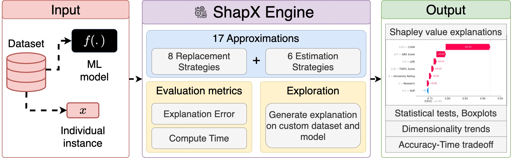
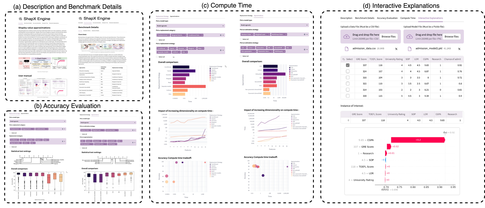
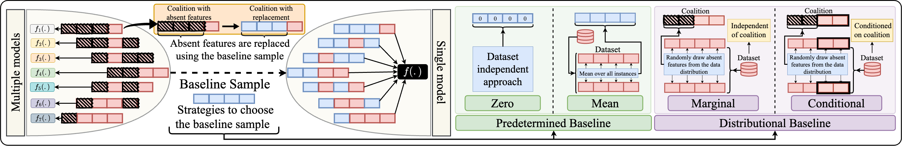

<h1 align="center">ShapX Engine</h1>
<h2 align="center">A Demonstration of Shapley Value Approximations</h2>

## 📄 Contents
1. [Overview](#overview)
2. [Demonstration](#start)
3. [Evaluation](#evaluation)
   
<h2 id="overview"> 1. Overview </h2>

Interpreting decisions made by machine learning models helps build trust in their predictions, ultimately facilitating their practical application. Shapley values have emerged as a popular and theoretically robust method for interpreting models by quantifying the contribution of each feature toward individual predictions. The inherent complexity associated with the computation of Shapley values as an NP-hard problem has driven the development of numerous approximation techniques, leading to a plethora of options in literature. This abundance of choices has created a substantial gap in determining the most appropriate approach for practical applications. To address this gap, we propose ShapX, a web engine that comprehensively evaluates 17 approximation methods across diverse regression and classification tasks. ShapX facilitates an interactive exploration of the strengths and limitations of various Shapley value approximations by guiding users through the suitable selections of replacement and tractable estimation strategies. Ultimately, our study reveals that strategies competent at capturing all the feature interactions leading to accurate estimations of Shapley values. ShapX also allows users to effortlessly upload their own dataset along with the corresponding machine learning model, enabling them to obtain detailed individualized explanations. A detailed walkthrough video of the demonstration is available online: [Video](https://youtu.be/5uPocjPUAA8).
<p align="center">

</p>

<h2 id="start"> 2. Get Started </h2>


**ShapX Engine** is a modular web interface designed to explore and evaluate various strategies for estimating Shapley values in machine learning. It offers a unified platform for benchmarking accuracy, assessing compute tradeoffs, and generating interactive model explanations for tabular data. [Launch App](https://shapleyexplanations.streamlit.app/) 


<p align="center">
  
</p>

## 🔍 Overview

The engine is structured into five primary frames:

---

### 🧾 (a) Description

- Introduces the motivation behind building a web-based explanation tool.
- Provides a comprehensive user guide to help users navigate the interface.

---

### 📊 (b) Benchmark Details

- Lists the Shapley value approximation techniques implemented.
- Describes the evaluation metrics used to assess accuracy and efficiency.
- Summarizes the datasets and models included in the benchmark suite.

---

### 📈 (c) Accuracy Evaluation

- Visualizes performance variation across estimators using:
  - **Boxplots** for accuracy distribution.
  - **Critical Difference Diagrams** for rank-based comparison.
- Supports evaluation by varying:
  - Replacement strategies.
  - Tractable estimation techniques.

---

### ⏱️ (d) Compute Time

- Compares per-instance runtime of different estimators.
- Includes:
  - **Bar plots** for runtime comparison.
  - **Line plots** showing the impact of input dimensionality.
  - **Bubble plots** visualizing the accuracy-runtime tradeoff.

---

### 🧠 (e) Interactive Explanations

- Upload a CSV dataset and pickled model (`.pkl`).
- Choose a sample instance for explanation.
- Generate Shapley values for that instance using the most effective method.
- View a visual plot showing each feature’s contribution to the prediction.

---

## 🚀 Getting Started

To launch locally:

```bash
git clone https://github.com/SuchitGupte/shapley_demo.git
cd shapley_demo
pip install -r requirements.txt
streamlit run app.py
```

<h2 id="evaluation"> 3. Evaluation </h2>

We break down the approximation of Shapley values into two
principal dimensions. These dimensions also serve as a guide for
setting up the evaluation framework. The first dimension involves
properly treating missing values with the help of different replacement strategies. We deploy each replacement strategy against an
exhaustive estimation of Shapley values. This evaluation measure
will highlight the strengths and weaknesses of replacement strategies, aiding future research in selecting the most reliable strategy.
<p align="center">

</p>


The second dimension focuses on tractable estimation strategies,
which are crucial for efficiently computing Shapley values. We analyze the performance of these tractable estimation strategies using
established approximation algorithms. We systematically evaluate
8 distinct replacement strategies and 17 distinct approximation algorithms across a diverse set of 100 datasets. This comprehensive
evaluation enables us to thoroughly assess the performance and
efficacy of different strategies and approximations in estimating
Shapley values across varied data scenarios.

| Approaches                                | Estimation Strategy                   | Replacement Strategy                                             |
|-------------------------------------------|---------------------------------------|------------------------------------------------------------------|
| Exhaustive Sampling                       | Exact (All potential feature subsets) | Conditional Distribution: Separate Models                        |
| Interactions-based Method for Explanation | Random Order                          | Marginal Distribution: Empirical                                 |
| Conditional Expectations Shapley          | Random Order                          | Conditional Distribution: Empirical                              |
| Shapley Cohort refinement                 | Random Order                          | Conditional Distribution: Empirical                              |
| Multilinear Sampling                      | Multilinear Extension                 | Marginal Distribution: Empirical                                 |
| KernelSHAP                                | Weighted Least Squares                | Marginal Distribution: Empirical                                 |
| Parametric KernelSHAP                     | Weighted Least Squares                | Conditional Distribution: Parametric Assumption(Gaussian/Copula) |
| Non-Parametric KernelSHAP                 | Weighted Least Squares                | Conditional Distribution: Empirical                              |
| SGD-Shapley                               | Weighted Least Squares                | Predetermined Baseline: Mean                                     |
| FastSHAP                                  | Weighted Least Squares                | Conditional Distribution: Surrogate model                        |
| Independent LinearSHAP                    | Linear                                | Marginal Distribution: Empirical                                 |
| Correlated LinearSHAP                     | Linear                                | Conditional Distribution: Parametric Assumption(Gaussian)        |
| Tree Interventional                       | Tree                                  | Marginal Distribution: Empirical                                 |
| Tree Path-dependent                       | Tree                                  | Conditional Distribution: Empirical                              |
| DeepLIFT                                  | Deep                                  | Predetermined Baseline: All-zeros                                |
| DeepSHAP                                  | Deep                                  | Marginal Distribution: Empirical                                 |
| DASP                                      | Deep                                  | Predetermined Baseline: Mean                                     |

